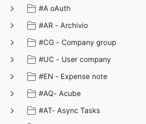
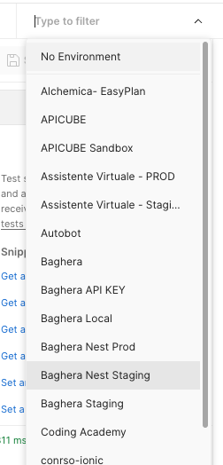

# Postman Collection Management Style Guide

## Folder Structure

- Group APIs into folders named with `#ID - MAIN ENTITY OR CONCEPT`.
- ID: 1-3 uppercase letters.

## API Call Naming

- Name API calls by referencing folder ID and a method number for easy identification.

## Handling API Variants

- Document API variants, including query string values.
- Append a lowercase letter to the API's ID for differentiation.

## Environment Use

- Use Environments for testing APIs and defining PATHs.
- Use the `{{url}}` variable for base path addresses.
- Pre-prepared environments available, including localhost.

- 
## Authentication
- Manage authentication via Postman.
- Use "test" in login calls to save tokens.
- Set authentication at the collection level, excluding login.

## Additional Best Practices

1. **Descriptive Annotations:** Include comments or descriptions for complex API calls to aid understanding.
2. **Consistent Parameter Naming:** Use a consistent naming scheme for query and path parameters.
3. **Error Handling:** Document common error responses for each API call.
4. **Version Control:** Keep track of changes using version numbers in the collection metadata.
5. **Automated Tests:** Write basic tests for each API call to validate response status, format, and key values.