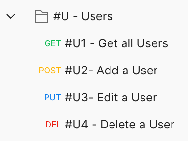
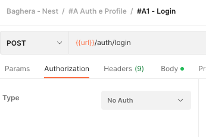

# Postman Style Guide
Postman is a powerfull tool, part of the Company API Development Process. It is used: 
- API Documentation Repository
- Integration Tool 
- Testing Tool 
- Development Tool

To better understand this Styleguide please be aware of the [REST API Styleguide](/rest/REST.MD)

## Collection
A Collection is a Root entity rapresenting a Project or Part of a Project. Any Project having APIs *SHOULD* have one or  more collection attached. A Collection *MUST* contain Only Folders. Each Folder rapresent a single Entity or Application Concept. 

### Folder Naming
Folder Naming *MUST* be consistent accross each Project and *SHOULD* be consistent accross all the Projects. 

There are 2 possible kind of folders:
- **Grouping Folders**: Folders only containing subfolders. Those folders *MAY* be created when there is the need to group specific APIs together, i.e. to grup all the Administrative APIs
- **Standard Folders**: Folders containing APIs and Optionally Subfolders

Grouping Folders may contain or be contained into Standard Folders and Vice Versa

**The Grouping Folders** *MUST* be named with the Name identifying the group they represent and *MUST* start Capital Letters for the core Concepts. 

**The Standard Folders** name *MUST* follow the format: `#ID - Entity/Concept`.
- ID: *MUST* be 1-3 uppercase letters and *SHOULD* remind of the Entity/Concept it represent. i.e. to represent the "User" entity the #U or #USR id should be preferred (instead of #US wich may be ambiguous)
- Entity Concept is the Entity/Concept name starting with a Capital Letter

Grouping Folders *MUST*  be placed before Standard folder and each set *MUST* be ordered in aplhabetical Order

## API Call Naming
The API Calls *MUST* follow the naming standrd: `#IDN - Description`
- `#ID` is the #ID of the containing folder and represent the Entity the API il referred to
- `N` is aprogressive intege number identifing the specific api call
- `Description` is a sintetic description of the specific API Action. It *MUST* start with Uppercase and use Uppercase for Entities 

### Tracking API Variants
Some APIs May have variants such as different Parameters that may affest the results of the API usage, such as Query String Parameters or specific HTTP Headers. The API Variants *SHOULD* be always documented.

The API variants *MUST* be named against the base api, adding a lowercase incremental letter to the API and a n improved description pointing out the specificity of the variant

## Environment 

Environments are a powerfull tool that allow to speed up the test of the API's against different environment, such as i.e. localhost, staging, production
Every Project *MUST* user environments to store at minimum the following information:

 - url: this variable contains the BASE PATH of the Webservice to test terminating WITHOUT an endong slash

**In case the API uses Authentication:**
- token: store the current bearer token. See the Authentication paragraph
- refresh_token: 
- Use Environments for testing APIs and defining PATHs.
- Use the `{{url}}` variable for base path addresses.

Each Environment of the project *MUST* be rapresentend in a specific Postman Environment in order to fully take advantage of the function and let other users to easily switch tha API testing to their needed environment.

The variable saved into the Postman Environment *MUST* always referd to as environment variables. The Webservice URL *MUST* always be an Environment Variable

## Authentication
We take advantage of the postaman advanced functions in order to custom integrate our Oauth Based Autheticatin process into the tool. 

1. Attach to the Login API a test that read the response and in case of successfull login save the token and refresh_token into the environment

2. Set authentication at the collection level and configure each API or Folder to inherit the Auth from the parent

3. Exclude Login API from the Authentication inheritance

## Additional Best Practices

1. **Descriptive Annotations:** Include comments or descriptions for complex API calls to aid understanding.
2. **Consistent Parameter Naming:** Use a consistent naming scheme for query and path parameters.
3. **Error Handling:** Document common error responses for each API call.
4. **Version Control:** Keep track of changes using version numbers in the collection metadata.
5. **Automated Tests:** Write basic tests for each API call to validate response status, format, and key values.
